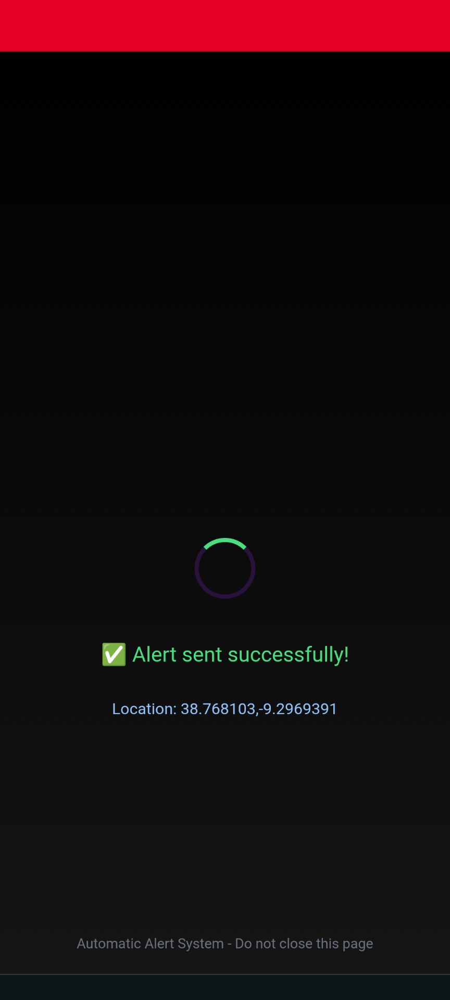
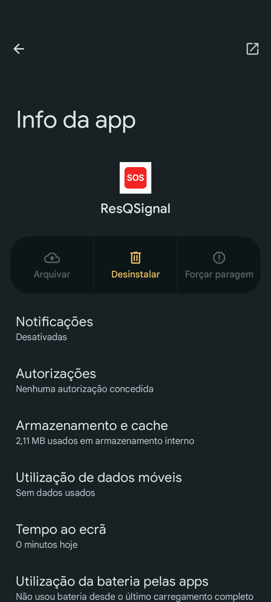

# ResQSignal 🚨

**ResQSignal** is an emergency alert platform that lets users instantly notify their trusted contacts via SMS — even if the user is offline. Each user gets a unique alert link that can be triggered from any device, at any time.

> ⚠️ For alerts to be sent, the **ResQSignal server must be online**. Your contacts don’t need to install anything — they just receive the messages.
> 🧪 Want to test the real SMS alert system? please contact me.
> I can activate a **Premium test account** for you so you can try the emergency alert feature (SMS delivery + GPS).  

---

🌐 **Live:** [resqsignal.com](https://resqsignal.com)

---

## 🔧 Built for Reliability

ResQSignal was built from the ground up with **Docker** to ensure portability, reproducibility, and fast deployment — whether on local machines or cloud platforms.

---

## 🔥 Features

- ✅ One-click emergency alert via unique token link  
- ✅ Alerts sent to trusted contacts via Twilio SMS  
- ✅ Includes GPS location (Premium users only)  
- ✅ Works even if the user is offline  
- ✅ Multilingual (🇵🇹 Portuguese + 🇬🇧 English)  
- ✅ Email verification & password reset  
- ✅ Subscription billing with Stripe  
- ✅ Admin tools for usage tracking  
- ✅ 100% containerized (Docker)

---

## 💻 Tech Stack

- **Backend:** Django + Django REST Framework  
- **Frontend:** React + Tailwind CSS  
- **Auth:** JWT (with Django Allauth & dj-rest-auth)  
- **Payments:** Stripe  
- **SMS Delivery:** Twilio  
- **Emails:** SendGrid  
- **Infrastructure:** Docker + Docker Compose  
- **Deployment:** Render (backend) & Netlify (frontend)

---

## 📦 Plans & Pricing

- **Basic:** €3/month – Send real alerts to up to 3 contacts  
- **Premium:** €5/month – Up to 10 contacts + GPS location    
- **First real alert is free** (for test/setup)

---

## 🔐 Security

- Emails must be verified before login  
- Passwords must meet strong complexity requirements  
- All communication is secured over HTTPS  
- Your emergency contact list is never shared

---

## 👨‍👩‍👧‍👦 Who is it for?

ResQSignal is designed for:

- Families with elderly or vulnerable relatives  
- Individuals who live alone  
- Outdoor adventurers, hikers, or remote workers  
- Anyone who wants to ensure fast help during emergencies

---

## 🖼️ Screenshots

### 📲 Emergency Alert Screen

---

### 📱 Installable PWA Interface

---

## ⚙️ Local Development

ResQSignal is fully Dockerized and was originally designed for local development with:

- `docker-compose` for backend services
- `.env.dev` files for secure config
- Separate containers for backend and frontend

🛠️ Due to recent production changes, local setup instructions are being updated.  
For now, please explore the **live version** at [resqsignal.com](https://resqsignal.com) or contact me if you’d like help running it locally, always up to help.

---

## 📫 Contact

Want to collaborate or give feedback?

- 📧 valdemarnoivo@gmail.com  
- 🔗 [LinkedIn](https://www.linkedin.com/in/valdemar-santos)  
- 🐙 [GitHub](https://github.com/juganstar)
